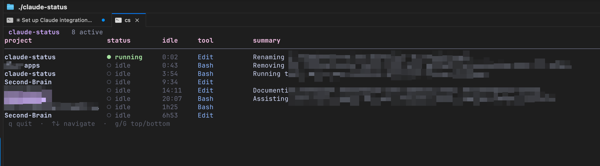

<h1 align="center">claude-tower</h1>

<h3 align="center">A terminal control tower for all your Claude Code sessions — a macro view of what every agent is doing, with live status, idle time, and one-line AI summaries. Built for running many agents at once.</h3>

<p align="center">
  <a href="https://github.com/PierrickMartos/claude-tower/releases/latest"></a>
</p>

<p align="center">
  
</p>

## Features

|  |  |
|---|---|
| **Every session, one screen** | Subscribes to cmux's event feed and keeps a live registry of every Claude Code session — across projects and worktrees. |
| **Status at a glance** | `running` / `awaiting` / `idle` with per-session idle timers and the last tool each agent touched. |
| **AI summaries** | A debounced Haiku call turns the last ~20 transcript messages into a one-line "what is this session actually doing" summary. |
| **Zero config auth** | Reuses the OAuth token from your existing Claude Code login in the macOS keychain. No API key, no env var. |
| **Resumable** | A cursor file lets the cmux subscriber pick up where it left off after a restart; the subprocess auto-reconnects with backoff. |

## Install

> **macOS only.** Requires [cmux](https://cmux.com) running locally and a recent Claude Code install.

### Download a binary

Grab the latest build for your Mac — these links always point to the newest release:

| Chip | Download |
|---|---|
| Apple Silicon (M1+) | [claude-tower-darwin-arm64](https://github.com/PierrickMartos/claude-tower/releases/latest/download/claude-tower-darwin-arm64) |
| Intel | [claude-tower-darwin-amd64](https://github.com/PierrickMartos/claude-tower/releases/latest/download/claude-tower-darwin-amd64) |

```bash
curl -fsSL -o claude-tower https://github.com/PierrickMartos/claude-tower/releases/latest/download/claude-tower-darwin-arm64
chmod +x claude-tower
xattr -d com.apple.quarantine claude-tower  # unsigned binary — clear Gatekeeper flag
./claude-tower
```

### Or build from source

```bash
# 1. Install Go (one-time)
brew install go

# 2. Clone, then build:
git clone https://github.com/PierrickMartos/claude-tower.git
cd claude-tower
go mod tidy
go build

# 3. Run — auth is read from your Claude Code login (macOS keychain).
#    If you're not logged in yet, run `claude` once to authenticate.
./claude-tower
```

## Keyboard shortcuts

| Key | Action |
|---|---|
| `j` / `k` or `↑` / `↓` | Navigate rows |
| `g` / `G` | Jump to top / bottom |
| `r` | Force re-summarise the focused row |
| `q` | Quit |

## How it works

1. Subscribes to `cmux events` (NDJSON socket stream, reconnects via `--cursor-file`).
2. Filters `agent.hook.*` events → maintains an in-memory session registry keyed by
   Claude session id (running / awaiting / idle status, last tool, idle time).
3. cmux **redacts tool input and prompt text by design**, so for the LLM summary the
   reader tails the matching transcript at `~/.claude/projects/<cwd>/<sid>.jsonl`.
4. A debounced (5s) per-session worker sends the last ~20 transcript messages to
   `claude-haiku-4-5` and gets back a one-line summary.

## Auth

Reads the OAuth access token your Claude Code login put in the macOS keychain
(`security find-generic-password -s "Claude Code-credentials"`). No environment
variable, no separate API key. Re-read on every call, so re-logging into Claude
Code (which refreshes the token) is picked up automatically.

If the token is missing or expired the summary falls back to the session's
`slug` (auto-generated by Claude Code, just less polished).

> ⚠️ **Unofficial use.** Anthropic's OAuth tokens are issued for Claude Code
> traffic. Inference calls work and many community tools rely on it, but it's
> not officially supported, and rate limits draw from your subscription.

## Layout

- `main.go` — wires everything together
- `internal/cmuxevents/` — subprocess wrapper around `cmux events`
- `internal/registry/` — session state map
- `internal/transcript/` — Claude Code JSONL reader
- `internal/creds/` — keychain OAuth token reader
- `internal/summarizer/` — Haiku one-liner
- `internal/ui/` — Bubble Tea model

## Troubleshooting

| Symptom | Fix |
|---|---|
| `cmux: command not found` | Install / launch [cmux](https://cmux.com), ensure `cmux` is on PATH |
| Empty table | No Claude sessions are running, or cmux hooks aren't installed (`cmux hooks setup --agent claude`) |
| Generic "[no summary]" rows | Not logged into `claude` yet, or first 5s debounce not elapsed |
| Rows show slug instead of summary | OAuth token expired — run `claude` once to refresh |
